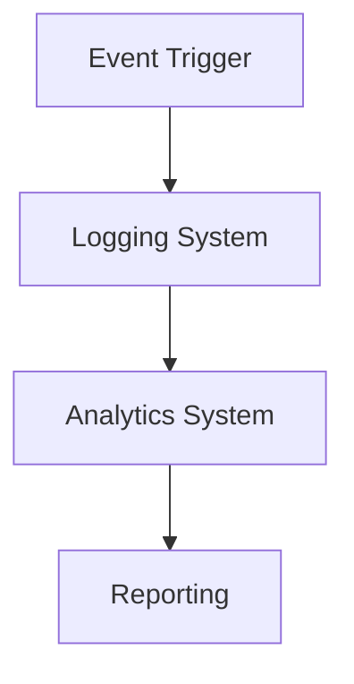

# Arquitectura del Gemelo Digital de Tienda Física

## 1. Visión General
Este documento describe la arquitectura del sistema de gemelo digital para una tienda física, implementado en Unreal Engine. El sistema proporciona una simulación en tiempo real de una tienda física con múltiples subsistemas integrados.

## 2. Componentes Principales

### 2.1 Sistema Central (Core)
- **BP_DigitalTwinGameMode**: Coordinador central del sistema
- **BP_SystemConfig**: Gestión de configuración global
- **BP_LoggingSystem**: Sistema de logging centralizado
- **BP_AnalyticsSystem**: Sistema de métricas y analytics

### 2.2 Seguridad
- **BP_SecurityCamera**: 
  - Detección de movimiento
  - Grabación en tiempo real
  - Análisis de video
- **BP_SecuritySystem**:
  - Gestión centralizada
  - Alertas y notificaciones
  - Integración con sistemas externos

### 2.3 Inventario y Productos
- **BP_ProductBase**:
  - Representación digital de productos
  - Atributos y estado en tiempo real
- **BP_InventoryManager**:
  - Gestión de stock
  - Sincronización con sistemas físicos
  - Alertas de inventario

### 2.4 Simulación de Clientes
- **BP_VirtualCustomer**:
  - IA de comportamiento
  - Patrones de compra
  - Interacción con productos
- **BP_CustomerSimulator**:
  - Gestión de población
  - Análisis de comportamiento
  - Generación de métricas

### 2.5 Integración IoT
- **BP_IoTManager**:
  - Comunicación MQTT
  - Gestión de sensores
  - Sincronización en tiempo real

## 3. Flujos de Datos

### 3.1 Actualización en Tiempo Real

### 3.2 Procesamiento de Eventos

## 4. Sistema de Testing

### 4.1 Pruebas Automatizadas
- Test unitarios por componente
- Pruebas de integración
- Validación de rendimiento

### 4.2 Entorno de Pruebas
- Configuración aislada
- Datos de prueba
- Métricas de cobertura

## 5. Mejores Prácticas

### 5.1 Desarrollo
- Uso de interfaces para desacoplamiento
- Patrones de diseño implementados
- Gestión de estado centralizada

### 5.2 Rendimiento
- Optimización de recursos
- Caché y buffering
- Gestión de memoria

## 6. Integración y Despliegue

### 6.1 Pipeline de CI/CD
- Validación automática
- Tests de regresión
- Despliegue controlado

### 6.2 Monitoreo
- Métricas en tiempo real
- Alertas y notificaciones
- Análisis de tendencias

## 7. Seguridad

### 7.1 Autenticación y Autorización
- Roles de usuario
- Control de acceso
- Auditoría de acciones

### 7.2 Protección de Datos
- Encriptación
- Backup automático
- Cumplimiento normativo

## 8. Escalabilidad

### 8.1 Horizontal
- Distribución de carga
- Replicación de datos
- Balanceo automático

### 8.2 Vertical
- Optimización de recursos
- Gestión de memoria
- Procesamiento paralelo 