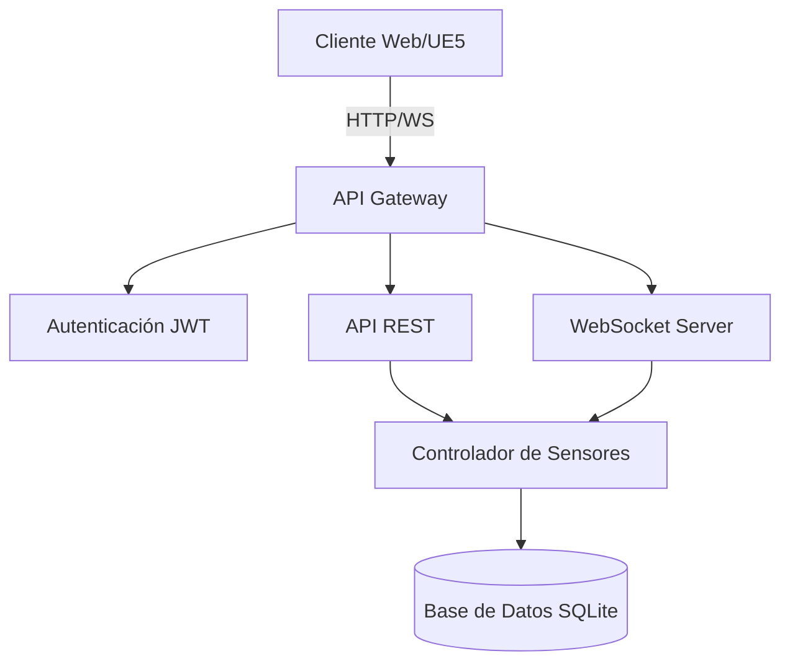

# Arquitectura del Sistema

## Componentes Principales



## Capas del Sistema

1. **Capa de Presentación**
   - Cliente Web
   - Unreal Engine 5.5
   - Visualización 3D

2. **Capa de Comunicación**
   - API Gateway
   - WebSocket Server
   - Gestión de Conexiones

3. **Capa de Negocio**
   - Autenticación y Autorización
   - Controladores
   - Lógica de Negocio

4. **Capa de Datos**
   - Base de Datos SQLite
   - Gestión de Datos de Sensores

## Flujo de Datos

1. **Ingreso de Datos**
   ```mermaid
   sequenceDiagram
       participant S as Sensor
       participant A as API
       participant DB as Database
       participant WS as WebSocket
       participant C as Clients
       
       S->>A: POST /sensors/data
       A->>DB: Store Data
       A->>WS: Notify Update
       WS->>C: Broadcast Update
   ```

2. **Consulta de Datos**
   ```mermaid
   sequenceDiagram
       participant C as Client
       participant A as API
       participant DB as Database
       
       C->>A: GET /sensors/all
       A->>DB: Query Data
       DB->>A: Return Results
       A->>C: Send Response
   ```

## Seguridad

1. **Autenticación**
   - JWT Tokens
   - Roles de Usuario
   - Middleware de Verificación

2. **Autorización**
   - Control de Acceso por Roles
   - Validación de Permisos
   - Protección de Rutas

## Escalabilidad

1. **Horizontal**
   - Múltiples instancias de API
   - Load Balancing
   - Sesiones distribuidas

2. **Vertical**
   - Optimización de recursos
   - Caché de consultas
   - Índices de base de datos 